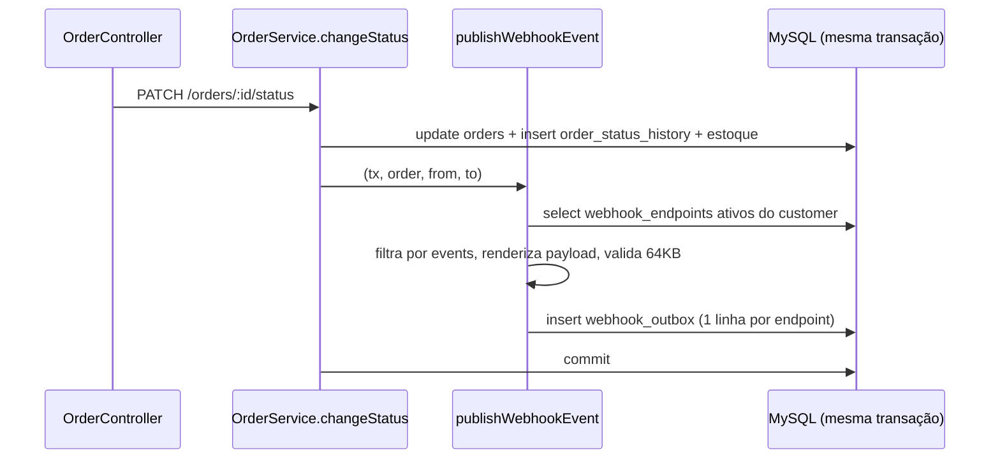

# FDD — Webhooks de Notificação de Mudança de Status de Pedidos

## Metadados

| Campo | Valor |
| --- | --- |
| **Autor** | Larissa (Tech Lead) |
| **Status** | Pronto para implementação |
| **Data** | 2026-10-06 |
| **Revisores** | Marcos (Product Manager), Bruno (Eng. Pleno, Pedidos), Diego (Eng. Sênior, Plataforma), Sofia (Eng. de Segurança) |
| **Origem** | Reunião técnica de kickoff (`TRANSCRICAO.md`) |
| **Documentos relacionados** | [RFC](./RFC.md), [ADRs](./adrs/), [PRD](./PRD.md), [Tracker](./TRACKER.md) |

## 1. Contexto e motivação técnica

Clientes B2B hoje descobrem mudanças de status fazendo polling em `GET /orders`. Vamos passar a notificá-los por webhooks de saída, com latência abaixo de 10 segundos (`[09:02] Marcos`).

A mudança de status acontece em `OrderService.changeStatus` (`src/modules/orders/order.service.ts`), dentro de um `prisma.$transaction` que atualiza `orders`, insere em `order_status_history` e ajusta estoque. A motivação técnica é emitir o evento **sem** colocar uma chamada HTTP a terceiros dentro dessa transação e **sem** permitir que o status mude sem que o evento seja registrado (`[09:04] Bruno`). A abordagem e suas alternativas estão no [RFC](./RFC.md); este documento descreve como construir.

## 2. Objetivos técnicos

1. Registrar o evento na mesma transação da mudança de status ([ADR-001](./adrs/ADR-001-outbox-no-mysql.md)).
2. Iniciar a primeira tentativa de entrega em menos de 10 segundos após o commit, com polling de 2 segundos ([ADR-002](./adrs/ADR-002-worker-dedicado-em-polling.md)).
3. Entregar com semântica at-least-once, identificando cada evento por `X-Event-Id` ([ADR-005](./adrs/ADR-005-garantia-at-least-once-com-event-id.md)).
4. Tolerar indisponibilidade do cliente por até ~15 horas e isolar falhas permanentes em DLQ com replay manual ([ADR-003](./adrs/ADR-003-retry-com-backoff-e-dead-letter-queue.md)).
5. Assinar cada requisição com HMAC-SHA256 usando secret exclusiva do endpoint, com rotação e carência de 24h ([ADR-004](./adrs/ADR-004-hmac-sha256-com-secret-por-endpoint.md)).
6. Preservar a ordem de entrega por pedido ([ADR-007](./adrs/ADR-007-ordenacao-por-order-id-sem-garantia-global.md)).
7. Não adicionar dependências nem infraestrutura; seguir os padrões do projeto ([ADR-006](./adrs/ADR-006-reuso-dos-padroes-existentes-do-projeto.md)).

## 3. Escopo e exclusões

**No escopo**

- CRUD de configuração de webhooks por cliente, com filtro de status.
- Rotação de secret via API.
- Histórico de entregas por webhook.
- Publicação transacional na outbox a partir de `changeStatus`.
- Worker de entrega com retry, backoff e DLQ.
- Replay administrativo de DLQ, restrito a `ADMIN` e auditado.

**Fora do escopo**

- Notificação por email quando o webhook do cliente falha: próxima fase (`[09:37] Larissa`).
- Rate limiting de saída: observar e decidir depois (`[09:39] Larissa`).
- Dashboard visual: projeto separado do time de frontend (`[09:40] Larissa`).
- Arquivamento de linhas entregues da outbox (`[09:08] Diego`).
- Múltiplos workers em paralelo (`[09:13] Diego`).
- Webhooks de entrada (`[09:02] Marcos`).
- Endurecimento de permissões do CRUD (`[09:37] Sofia`).
- Garantia exactly-once e ordenação global.

## 4. Modelo de dados

Quatro tabelas novas em `prisma/schema.prisma`, todas com chave primária UUID em `@db.Char(36)`, como o restante do schema.

| Tabela (modelo Prisma) | Papel | Campos principais |
| --- | --- | --- |
| `webhook_endpoints` (`WebhookEndpoint`) | Configuração por cliente | `id`, `customerId` (FK `customers`), `url`, `secret`, `previousSecret?`, `previousSecretExpiresAt?`, `events` (Json: lista de `OrderStatus`), `active`, `createdAt`, `updatedAt` |
| `webhook_outbox` (`WebhookOutbox`) | Fila de eventos a entregar | `id` (é o `event_id`), `webhookId` (FK, cascade), `orderId`, `eventType`, `payload` (Json), `status`, `attempts`, `nextAttemptAt`, `lockedAt?`, `lastError?`, `createdAt`, `updatedAt`, `deliveredAt?` |
| `webhook_deliveries` (`WebhookDelivery`) | Uma linha por tentativa HTTP | `id`, `eventId` (FK outbox, cascade), `webhookId`, `attempt`, `success`, `statusCode?`, `responseBody?`, `durationMs`, `errorCode?`, `createdAt` |
| `webhook_dead_letter` (`WebhookDeadLetter`) | Falhas permanentes | `id`, `eventId`, `webhookId`, `orderId`, `payload` (Json), `failureReason`, `attempts`, `failedAt`, `replayedAt?`, `replayedById?` |

Enum novo: `WebhookOutboxStatus { PENDING, PROCESSING, FAILED, DELIVERED }`, correspondendo a pendente, processando, falhou e entregue (`[09:08] Diego`).

Índices:

- `webhook_outbox`: `(status, nextAttemptAt)` e `(createdAt)`; `(webhookId, orderId, createdAt)` para a regra de ordenação da seção 5.2.
- `webhook_endpoints`: `(customerId, active)`.
- `webhook_deliveries`: `(webhookId, createdAt)`.
- `webhook_dead_letter`: `(eventId)`.

Definições de modelagem:

- **Uma linha de outbox por endpoint assinante.** Se o cliente tem dois webhooks que assinam o status, a mesma transição gera duas linhas, cada uma com seu `event_id` e seu próprio estado de retry.
- **`webhook_outbox.orderId` não é chave estrangeira.** `OrderService.delete` permite apagar pedidos `PENDING` ou `CANCELLED`; como o payload é snapshot ([ADR-008](./adrs/ADR-008-snapshot-do-payload-na-insercao-do-outbox.md)), o evento deve sobreviver à remoção do pedido.
- **O `id` da outbox é gerado na aplicação** (pacote `uuid`, já no projeto), porque precisa constar dentro do payload renderizado na inserção.
- **A secret é armazenada em texto recuperável**, pois o HMAC exige o valor original. Proteção em repouso fica para a revisão de segurança (seção 11).

## 5. Fluxos detalhados

### 5.1 Criação do evento na outbox

Executado por `publishWebhookEvent(tx, order, fromStatus, toStatus)` (`[09:41] Bruno`), em `src/modules/webhooks/webhook.publisher.ts`, chamado dentro da transação de `changeStatus`.



1. Busca os endpoints com `customerId = order.customerId` e `active = true`.
2. Mantém apenas os que têm `toStatus` em `events`. Se nenhum sobrar, retorna sem inserir.
3. Para cada endpoint, gera o `event_id` e renderiza o payload (seção 6.9) com os dados do pedido naquele instante.
4. Se o payload serializado passar de 64KB, lança `WEBHOOK_PAYLOAD_TOO_LARGE` (`[09:23] Sofia`).
5. Insere as linhas com `status = PENDING`, `attempts = 0`, `nextAttemptAt = now()`.

Qualquer erro em `publishWebhookEvent` propaga e desfaz a transação inteira: o status não muda (`[09:40] Bruno`).

A criação do pedido (`OrderService.create`, que grava o histórico `null → PENDING`) **não** publica evento: a reunião tratou apenas de mudança de status.

### 5.2 Processamento pelo worker

Entry-point `src/worker.ts`; lógica em `src/modules/webhooks/webhook.processor.ts`. O loop usa `setTimeout` reagendado ao fim de cada ciclo, para que ciclos nunca se sobreponham.

A cada 2 segundos:

1. **Recuperação.** Linhas em `PROCESSING` com `lockedAt` há mais de 60 segundos voltam para `PENDING`, sem incrementar `attempts`. Cobre queda do worker no meio de um envio; a possível reentrega é coberta pelo at-least-once.
2. **Seleção.** Até 20 linhas com `status = PENDING` e `nextAttemptAt <= now()`, ordenadas por `createdAt` ascendente, excluindo as que têm um evento mais antigo do mesmo `(webhookId, orderId)` ainda em `PENDING` ou `PROCESSING`:

   ```sql
   SELECT o.id FROM webhook_outbox o
   WHERE o.status = 'PENDING' AND o.nextAttemptAt <= NOW(3)
     AND NOT EXISTS (
       SELECT 1 FROM webhook_outbox older
       WHERE older.webhookId = o.webhookId AND older.orderId = o.orderId
         AND older.createdAt < o.createdAt
         AND older.status IN ('PENDING', 'PROCESSING'))
   ORDER BY o.createdAt ASC LIMIT 20;
   ```

   Essa exclusão é o que mantém a ordem por pedido ([ADR-007](./adrs/ADR-007-ordenacao-por-order-id-sem-garantia-global.md)) quando há retry: sem ela, `SHIPPED` seria entregue enquanto `PROCESSING` aguarda nova tentativa.
3. **Reserva.** `updateMany` das linhas selecionadas para `PROCESSING`, com `lockedAt = now()`.
4. **Envio.** As linhas do lote são enviadas em paralelo; a regra do passo 2 garante que nunca há dois eventos do mesmo pedido e endpoint no mesmo lote. Para cada uma:
   - carrega o endpoint; se estiver inativo, vai direto para a DLQ com motivo `WEBHOOK_INACTIVE`, sem chamada HTTP;
   - monta headers e assinatura (seção 6.9) e faz `POST` com timeout de 10 segundos, sem seguir redirecionamentos;
   - grava uma linha em `webhook_deliveries` com resultado, status HTTP, corpo da resposta truncado em 2KB e duração.
5. **Resultado.** Resposta `2xx`: `status = DELIVERED`, `deliveredAt = now()`. Qualquer outra resposta, timeout ou erro de rede: fluxo de retry.

O worker nunca relê o pedido: envia o payload armazenado ([ADR-008](./adrs/ADR-008-snapshot-do-payload-na-insercao-do-outbox.md)).

### 5.3 Retry

Na falha, incrementa `attempts`, grava `lastError` e devolve a linha para `PENDING` com `nextAttemptAt` conforme a tabela (`[09:17] Diego`):

| `attempts` após a falha | Próxima tentativa em |
| --- | --- |
| 1 | 1 minuto |
| 2 | 5 minutos |
| 3 | 30 minutos |
| 4 | 2 horas |
| 5 | 12 horas |
| 6 | não há: vai para a DLQ |

Ou seja, um envio inicial e até cinco retentativas, somando 14h36 entre a primeira falha e a última tentativa. Essa leitura segue a fala "quase 15 horas entre primeira falha e última tentativa"; a reunião também fala em "5 tentativas", o que admite a leitura de cinco envios no total. **A confirmar** (seção 14).

Todas as falhas são tratadas igual, inclusive respostas `4xx`.

### 5.4 DLQ e replay

Esgotadas as tentativas, na mesma transação:

1. a linha da outbox passa a `FAILED`;
2. é criada uma linha em `webhook_dead_letter` com payload, `failureReason` (último erro) e `attempts`.

Replay (`POST /admin/webhooks/dead-letter/:id/replay`, `[09:18] Diego`), em uma transação:

1. carrega o registro da DLQ; inexistente → `WEBHOOK_DEAD_LETTER_NOT_FOUND`;
2. já reprocessado (`replayedAt` preenchido) → `WEBHOOK_DEAD_LETTER_ALREADY_REPLAYED`;
3. endpoint inativo → `WEBHOOK_INACTIVE`;
4. a linha original da outbox volta a `PENDING`, com `attempts = 0` e `nextAttemptAt = now()`, **mantendo o mesmo `event_id`**, para que a deduplicação do cliente continue funcionando;
5. grava `replayedAt` e `replayedById` e emite o log de auditoria `webhook_dead_letter_replayed` (`[09:36] Sofia`).

Um evento reprocessado é entregue fora de ordem em relação aos eventos posteriores do mesmo pedido que já foram entregues. O cliente deve usar o campo `timestamp` do payload para ordenar.

## 6. Contratos públicos

Base: `/api/v1`. Todos os endpoints exigem `Authorization: Bearer <JWT>` (middleware `authenticate`). As respostas da API usam camelCase, como os demais módulos; o payload enviado ao cliente usa snake_case (seção 6.9). Erros seguem o formato do `errorMiddleware`: `{ "error": { "code", "message", "details?" } }`.

O `customerId` é informado no body (criação) e na query (listagem), repetindo o que `createOrderSchema` e `listOrdersQuerySchema` já fazem em `src/modules/orders/order.schemas.ts`. A reunião definiu apenas que ele não vem do JWT (`[09:32] Larissa`).

Qualquer role autenticada pode gerenciar webhooks de qualquer cliente nesta fase (`[09:36] Marcos`).

### 6.1 `POST /webhooks` — cadastrar

```json
{
  "customerId": "5b1f0c9e-6a4d-4f0e-9d53-2f1c7a9b8e10",
  "url": "https://erp.cliente.example/hooks/pedidos",
  "events": ["SHIPPED", "DELIVERED"]
}
```

`201 Created`:

```json
{
  "id": "0c6a3e52-8a55-4a37-b0a4-4f7f0f3c2b91",
  "customerId": "5b1f0c9e-6a4d-4f0e-9d53-2f1c7a9b8e10",
  "url": "https://erp.cliente.example/hooks/pedidos",
  "events": ["SHIPPED", "DELIVERED"],
  "active": true,
  "secret": "whsec_9f2c41d7a0b34e6c8d15f7a2b9e03c64d8a1f5027b6e4c93",
  "createdAt": "2026-10-06T14:02:11.000Z",
  "updatedAt": "2026-10-06T14:02:11.000Z"
}
```

- A secret é gerada pela plataforma e devolvida na criação (`[09:31] Marcos`). Ela só aparece nesta resposta e na de rotação; nenhum `GET` a retorna.
- `events`: lista não vazia de valores de `OrderStatus`.
- Erros: `400 VALIDATION_ERROR`, `400 WEBHOOK_INVALID_URL`, `401 UNAUTHORIZED`, `404 WEBHOOK_CUSTOMER_NOT_FOUND`.

### 6.2 `GET /webhooks?customerId=&page=&pageSize=` — listar

`200 OK`, no formato de `paginated()` (`src/shared/http/response.ts`):

```json
{
  "data": [
    {
      "id": "0c6a3e52-8a55-4a37-b0a4-4f7f0f3c2b91",
      "customerId": "5b1f0c9e-6a4d-4f0e-9d53-2f1c7a9b8e10",
      "url": "https://erp.cliente.example/hooks/pedidos",
      "events": ["SHIPPED", "DELIVERED"],
      "active": true,
      "createdAt": "2026-10-06T14:02:11.000Z",
      "updatedAt": "2026-10-06T14:02:11.000Z"
    }
  ],
  "pagination": { "page": 1, "pageSize": 20, "total": 1, "totalPages": 1 }
}
```

`customerId` é obrigatório. Erros: `400 VALIDATION_ERROR`, `401 UNAUTHORIZED`.

### 6.3 `PATCH /webhooks/:id` — editar

Aceita qualquer combinação de `url`, `events` e `active`:

```json
{ "events": ["PAID", "SHIPPED", "DELIVERED"], "active": false }
```

`200 OK` com o recurso atualizado, sem `secret`. Erros: `400 VALIDATION_ERROR`, `400 WEBHOOK_INVALID_URL`, `401 UNAUTHORIZED`, `404 WEBHOOK_NOT_FOUND`.

A mudança vale para eventos gerados a partir de então. Eventos já na outbox de um endpoint desativado vão para a DLQ (seção 5.2).

### 6.4 `DELETE /webhooks/:id` — remover

`204 No Content`. Remove o cadastro e, em cascata, seus eventos, entregas e registros de DLQ. Erros: `401 UNAUTHORIZED`, `404 WEBHOOK_NOT_FOUND`.

### 6.5 `POST /webhooks/:id/rotate-secret` — rotacionar secret

Sem body. `200 OK`:

```json
{
  "id": "0c6a3e52-8a55-4a37-b0a4-4f7f0f3c2b91",
  "secret": "whsec_4be81a6f20c94d37a5e1f08b3c7d92a6e0f4b1859d2c7a63",
  "previousSecretExpiresAt": "2026-10-07T14:30:00.000Z"
}
```

A secret anterior segue válida por 24 horas (`[09:21] Sofia`): nesse período cada requisição leva as duas assinaturas (seção 6.9). Uma nova rotação dentro da janela descarta imediatamente a secret mais antiga. Erros: `401 UNAUTHORIZED`, `404 WEBHOOK_NOT_FOUND`.

### 6.6 `GET /webhooks/:id/deliveries?page=&pageSize=` — histórico de entregas

Mais recentes primeiro; `pageSize` máximo de 100 (`[09:34] Marcos`). `200 OK`:

```json
{
  "data": [
    {
      "id": "b7a1d9c0-41e3-4c1b-9a70-0f6f6d1c9a22",
      "eventId": "e3f9a8b2-7c64-4d15-8f0a-1b2c3d4e5f60",
      "attempt": 2,
      "success": false,
      "statusCode": 503,
      "responseBody": "Service Unavailable",
      "durationMs": 412,
      "errorCode": "WEBHOOK_DELIVERY_HTTP_ERROR",
      "payload": { "event_id": "e3f9a8b2-7c64-4d15-8f0a-1b2c3d4e5f60", "event_type": "order.status_changed", "to_status": "SHIPPED" },
      "createdAt": "2026-10-06T14:10:02.000Z"
    }
  ],
  "pagination": { "page": 1, "pageSize": 20, "total": 1, "totalPages": 1 }
}
```

O `payload` vem completo (abreviado acima). Erros: `400 VALIDATION_ERROR`, `401 UNAUTHORIZED`, `404 WEBHOOK_NOT_FOUND`.

### 6.7 `POST /admin/webhooks/dead-letter/:id/replay` — reprocessar

Exige role `ADMIN` via `requireRole('ADMIN')` (`[09:36] Larissa`). Sem body. `202 Accepted`:

```json
{
  "deadLetterId": "9d2e7f10-3b4a-4c5d-8e6f-7a8b9c0d1e2f",
  "eventId": "e3f9a8b2-7c64-4d15-8f0a-1b2c3d4e5f60",
  "status": "PENDING",
  "replayedAt": "2026-10-06T15:00:00.000Z",
  "replayedById": "a1b2c3d4-e5f6-4a7b-8c9d-0e1f2a3b4c5d"
}
```

Erros: `401 UNAUTHORIZED`, `403 FORBIDDEN`, `404 WEBHOOK_DEAD_LETTER_NOT_FOUND`, `409 WEBHOOK_DEAD_LETTER_ALREADY_REPLAYED`, `409 WEBHOOK_INACTIVE`.

### 6.8 `GET /admin/webhooks/dead-letter?webhookId=&page=&pageSize=` — listar DLQ

Não foi discutido na reunião; sem ele o administrador não tem como descobrir o `id` a reprocessar. Exige `ADMIN`. `200 OK` paginado, com `id`, `eventId`, `webhookId`, `orderId`, `failureReason`, `attempts`, `failedAt`, `replayedAt`.

### 6.9 Requisição enviada ao cliente

`POST <url cadastrada>`, timeout de 10 segundos.

| Header | Valor | Origem |
| --- | --- | --- |
| `Content-Type` | `application/json` | `[09:44] Diego` |
| `X-Event-Id` | UUID do evento; igual em todas as tentativas | `[09:25] Diego` |
| `X-Webhook-Id` | `id` do endpoint cadastrado | `[09:44] Sofia` |
| `X-Timestamp` | instante do envio, ISO 8601 | `[09:44] Diego` |
| `X-Signature` | `sha256=<hex>` do HMAC-SHA256 do corpo com a secret do endpoint | `[09:20] Sofia` |

Durante a carência de rotação, `X-Signature` traz duas assinaturas separadas por vírgula, a da secret nova e a da anterior: `sha256=<nova>,sha256=<anterior>`. O cliente aceita a requisição se qualquer uma conferir com a secret que ele tem.

A assinatura cobre apenas os bytes do corpo (`[09:22] Sofia`). O `X-Timestamp` não é assinado; o instante da transição está no campo `timestamp` do corpo, que é.

Corpo (`[09:43] Diego`), sem `items`:

```json
{
  "event_id": "e3f9a8b2-7c64-4d15-8f0a-1b2c3d4e5f60",
  "event_type": "order.status_changed",
  "timestamp": "2026-10-06T14:05:33.120Z",
  "order_id": "7e2b1a90-5c3d-4e8f-a1b2-c3d4e5f60718",
  "order_number": "ORD-000123",
  "from_status": "PROCESSING",
  "to_status": "SHIPPED",
  "customer_id": "5b1f0c9e-6a4d-4f0e-9d53-2f1c7a9b8e10",
  "total_cents": 158900
}
```

Semântica para o cliente: responder `2xx` em até 10 segundos confirma o recebimento; qualquer outra coisa gera nova tentativa. O mesmo `event_id` pode chegar mais de uma vez e deve ser deduplicado.

## 7. Matriz de erros

Novas classes em `src/shared/errors/http-errors.ts`, exportadas por `src/shared/errors/index.ts`, no mesmo molde de `InsufficientStockError` e `InvalidStatusTransitionError` (`[09:28] Bruno`). O `errorMiddleware` as trata sem alteração.

**Erros da API**

| Código | HTTP | Classe (base) | Quando |
| --- | --- | --- | --- |
| `WEBHOOK_NOT_FOUND` | 404 | `WebhookNotFoundError` (`AppError`) | Webhook `:id` não existe |
| `WEBHOOK_CUSTOMER_NOT_FOUND` | 404 | `WebhookCustomerNotFoundError` (`AppError`) | `customerId` informado não existe |
| `WEBHOOK_INVALID_URL` | 400 | `WebhookInvalidUrlError` (`BadRequestError`) | URL não usa `https` (`[09:23] Sofia`) |
| `WEBHOOK_PAYLOAD_TOO_LARGE` | 422 | `WebhookPayloadTooLargeError` (`UnprocessableEntityError`) | Payload renderizado acima de 64KB; ocorre em `PATCH /orders/:id/status` e desfaz a mudança de status |
| `WEBHOOK_DEAD_LETTER_NOT_FOUND` | 404 | `WebhookDeadLetterNotFoundError` (`AppError`) | Registro da DLQ não existe |
| `WEBHOOK_DEAD_LETTER_ALREADY_REPLAYED` | 409 | `WebhookDeadLetterAlreadyReplayedError` (`ConflictError`) | Replay repetido do mesmo registro |
| `WEBHOOK_INACTIVE` | 409 | `WebhookInactiveError` (`ConflictError`) | Replay para endpoint desativado |

Erros já existentes reaproveitados: `VALIDATION_ERROR` (400), `UNAUTHORIZED` (401), `FORBIDDEN` (403).

Duas observações de implementação decorrentes do código atual:

- `NotFoundError` fixa o código em `NOT_FOUND` e não aceita outro; por isso as classes 404 de webhook estendem `AppError` diretamente.
- O middleware `validate` converte toda falha de Zod em `VALIDATION_ERROR`. Para devolver `WEBHOOK_INVALID_URL`, o schema Zod valida apenas a forma (`z.string().url()`) e a exigência de `https` é verificada no service. O efeito é o pedido por Sofia; muda só o lugar da checagem.

**Erros de entrega** (não são respostas HTTP da API; ficam em `webhook_deliveries.errorCode`, `webhook_outbox.lastError` e `webhook_dead_letter.failureReason`)

| Código | Quando | Tratamento |
| --- | --- | --- |
| `WEBHOOK_DELIVERY_TIMEOUT` | Cliente não respondeu em 10s | Retry |
| `WEBHOOK_DELIVERY_HTTP_ERROR` | Resposta fora de `2xx` | Retry |
| `WEBHOOK_DELIVERY_NETWORK_ERROR` | DNS, conexão recusada, falha de TLS | Retry |
| `WEBHOOK_INACTIVE` | Endpoint desativado com evento pendente | DLQ direto |
| `WEBHOOK_SECRET_REQUIRED` | Endpoint sem secret no momento do envio (invariante violada) | DLQ direto |
| `WEBHOOK_MAX_ATTEMPTS_EXCEEDED` | Tentativas esgotadas | DLQ |

`WEBHOOK_SECRET_REQUIRED` foi citado na reunião como exemplo de código, sem semântica definida; a atribuição acima é definida neste documento.

## 8. Estratégias de resiliência

| Mecanismo | Definição |
| --- | --- |
| **Timeout** | 10 segundos por chamada HTTP, via `AbortSignal.timeout` do `fetch` nativo do Node 20 (`[09:42] Diego`) |
| **Retry e backoff** | Até 5 retentativas em 1m, 5m, 30m, 2h, 12h (seção 5.3) |
| **Fallback** | DLQ com replay manual por `ADMIN`. Não há fallback automático: email está fora do escopo. Para o cliente, `GET /orders` continua disponível |
| **Atomicidade** | Evento e mudança de status na mesma transação; falha em um desfaz o outro |
| **Isolamento** | Worker em processo separado: queda da API não interrompe entregas e vice-versa (`[09:11] Diego`) |
| **Recuperação de queda** | Linhas presas em `PROCESSING` por mais de 60s voltam a `PENDING` |
| **Encerramento gracioso** | Em `SIGINT`/`SIGTERM`, o worker para de agendar ciclos, aguarda os envios em curso e desconecta o Prisma, como `src/server.ts` faz |
| **Erro no ciclo** | Exceção em um ciclo é registrada (`webhook_worker_cycle_failed`) e o loop continua; o processo não cai |
| **Lentidão de um cliente** | Envio paralelo dentro do lote impede que um endpoint lento atrase os demais além de um ciclo |
| **Duplicidade** | Reentregas são esperadas; o `X-Event-Id` é estável entre tentativas |

Parâmetros em `src/config/env.ts`, com os valores decididos como padrão: `WEBHOOK_POLL_INTERVAL_MS=2000`, `WEBHOOK_BATCH_SIZE=20`, `WEBHOOK_HTTP_TIMEOUT_MS=10000`, `WEBHOOK_MAX_PAYLOAD_BYTES=65536`. Servem principalmente para encurtar tempos nos testes.

## 9. Observabilidade

O projeto tem Pino e não tem biblioteca de métricas nem de tracing; pela decisão de não adicionar nada novo (`[09:29] Bruno`), a observabilidade desta fase é construída sobre logs estruturados e sobre as próprias tabelas.

**Logs.** Logger existente (`src/shared/logger/index.ts`), com `logger.child({ component: 'webhook-worker' })` no worker. Nomes em snake_case, como `server_started` e `http_request`. Todo log de entrega leva `eventId`, `webhookId`, `orderId` e `attempt`.

| Evento | Nível | Campos adicionais |
| --- | --- | --- |
| `webhook_event_enqueued` | info | `toStatus` |
| `webhook_delivery_succeeded` | info | `statusCode`, `durationMs` |
| `webhook_delivery_failed` | warn | `errorCode`, `statusCode`, `durationMs` |
| `webhook_retry_scheduled` | info | `nextAttemptAt` |
| `webhook_moved_to_dead_letter` | error | `failureReason`, `attempts` |
| `webhook_dead_letter_replayed` | info | `deadLetterId`, `userId` (auditoria) |
| `webhook_secret_rotated` | info | `userId`, `previousSecretExpiresAt` |
| `webhook_worker_started` / `webhook_worker_stopped` | info | `pollIntervalMs`, `batchSize` |
| `webhook_worker_cycle_failed` | error | `err` |

Secrets e assinaturas nunca são logadas: acrescentar `*.secret`, `*.previousSecret` e `*.headers["x-signature"]` a `redactPaths` (`[09:22] Diego`).

**Métricas.** Derivadas dos logs acima e de um log `webhook_worker_stats` emitido pelo worker a cada minuto:

| Métrica | Tipo | Fonte |
| --- | --- | --- |
| `webhook_deliveries_total{result}` | contador | logs `webhook_delivery_succeeded` / `_failed` |
| `webhook_delivery_duration_ms` | histograma | campo `durationMs` |
| `webhook_retries_total` | contador | log `webhook_retry_scheduled` |
| `webhook_dead_letter_total` | contador | log `webhook_moved_to_dead_letter` |
| `webhook_outbox_pending` | gauge | `webhook_worker_stats` (count de `PENDING`) |
| `webhook_outbox_oldest_pending_age_seconds` | gauge | `webhook_worker_stats`; indicador direto do requisito de 10s |
| `webhook_dead_letter_open` | gauge | `webhook_worker_stats` (DLQ sem `replayedAt`) |

Alertas sugeridos: idade do pendente mais antigo acima de 10s por mais de 1 minuto (worker parado ou sobrecarregado) e crescimento de `webhook_dead_letter_open`. `webhook_deliveries_total` por `webhookId` é também o sinal para a questão em aberto de rate limiting.

**Tracing.** Sem tracing distribuído nesta fase. A correlação ponta a ponta é feita pelo `eventId`, que aparece na outbox, em cada linha de `webhook_deliveries`, na DLQ, em todos os logs e no header `X-Event-Id` recebido pelo cliente. Do lado da API, o `requestId` já gerado por `src/middlewares/request-logger.middleware.ts` identifica a requisição que originou a mudança; a ligação entre ela e o evento se faz por `orderId` e horário.

## 10. Integração com o sistema existente

| Arquivo | Mudança |
| --- | --- |
| `src/modules/orders/order.service.ts` | Chamar `publishWebhookEvent` dentro da transação de `changeStatus` |
| `prisma/schema.prisma` | Novo enum, quatro modelos e relação em `Customer`; nova migration |
| `src/shared/errors/http-errors.ts` e `index.ts` | Novas classes `Webhook*Error` |
| `src/app.ts` | Instanciar repository, service e controller de webhooks em `buildControllers` |
| `src/routes/index.ts` | Registrar os routers de webhooks |
| `src/config/env.ts` | Quatro variáveis `WEBHOOK_*` com default |
| `src/shared/logger/index.ts` | Novos caminhos em `redactPaths` |
| `package.json` | Scripts `worker` e `dev:worker` |
| `tests/setup.ts` | Limpeza das novas tabelas |
| `src/middlewares/error.middleware.ts`, `auth.middleware.ts`, `validate.middleware.ts`, `src/shared/http/response.ts`, `src/config/database.ts` | Reutilizados **sem alteração** |

**`src/modules/orders/order.service.ts`.** Única alteração em código crítico. A chamada entra depois de `tx.orderStatusHistory.create` e antes da releitura do pedido:

```ts
await tx.orderStatusHistory.create({ /* ...inalterado... */ });

await publishWebhookEvent(tx, order, from, to); // novo

const refreshed = await tx.order.findUnique({ /* ...inalterado... */ });
```

`publishWebhookEvent` é uma função importada do módulo de webhooks, que recebe o `tx` já em uso (`type TxClient = Prisma.TransactionClient`, declarado no próprio arquivo). O construtor de `OrderService` não muda e nenhum repository é injetado (`[09:41] Diego`). A variável `order`, carregada no início do método, já tem `id`, `orderNumber`, `customerId` e `totalCents`; `from` e `to` são passados à parte porque `order.status` ainda guarda o valor antigo. O contrato de `PATCH /orders/:id/status` não muda, exceto pela possibilidade de `422 WEBHOOK_PAYLOAD_TOO_LARGE`.

**`prisma/schema.prisma`.** Os modelos da seção 4 seguem as convenções do arquivo: `@id @default(uuid()) @db.Char(36)`, `@@map` em snake_case, `@@index` explícitos. `Customer` ganha `webhookEndpoints WebhookEndpoint[]`. `WebhookOutbox.id` não usa `@default(uuid())`, pois é gerado na aplicação. A migration é apenas aditiva.

**`src/shared/errors/http-errors.ts`.** As classes da seção 7 são acrescentadas ao fim do arquivo e exportadas em `src/shared/errors/index.ts`. Exemplo:

```ts
export class WebhookNotFoundError extends AppError {
  constructor() {
    super('Webhook not found', 404, 'WEBHOOK_NOT_FOUND');
  }
}
```

**`src/middlewares/error.middleware.ts`.** Sem alteração: o ramo `err instanceof AppError` já serializa `errorCode`, `message` e `details`.

**`src/middlewares/auth.middleware.ts`.** `authenticate` é aplicado com `router.use` nos dois routers, como em `order.routes.ts`. O router administrativo acrescenta `requireRole('ADMIN')`. O `req.user.id` preenchido por `authenticate` é o `replayedById` e o `userId` dos logs de auditoria.

**`src/middlewares/validate.middleware.ts`.** Os schemas de `webhook.schemas.ts` são aplicados com `validate({ body, query, params })`, como nas rotas de pedidos.

**`src/app.ts` e `src/routes/index.ts`.** `buildControllers` instancia `WebhookRepository`, `WebhookService` e `WebhookController`, como faz com os demais módulos. O tipo `Controllers` ganha a chave `webhooks`, e `buildApiRouter` monta `/webhooks` (`buildWebhookRouter`) e `/admin/webhooks` (`buildWebhookAdminRouter`).

**`src/server.ts` e `src/config/database.ts`.** `src/worker.ts` repete a estrutura de `server.ts`: `bootstrap()`, tratamento de `SIGINT`/`SIGTERM`, `logger.fatal` e `process.exit(1)` em falha de inicialização. Ele importa `prisma` de `src/config/database.ts`; por ser outro processo Node, isso resulta em uma instância própria de `PrismaClient` ligada à mesma `DATABASE_URL` (`[09:30] Bruno`).

**`package.json`.** Novos scripts, espelhando `dev` e `start`: `"dev:worker": "tsx watch --env-file=.env src/worker.ts"` e `"worker": "node --env-file=.env dist/worker.js"`.

**`tests/setup.ts`.** O `beforeEach` passa a limpar `webhookDelivery`, `webhookDeadLetter`, `webhookOutbox` e `webhookEndpoint`, nessa ordem e antes de `customer.deleteMany()`, por causa da chave estrangeira para `customers`.

**Arquivos novos**

```
src/worker.ts
src/modules/webhooks/
  webhook.controller.ts   webhook.service.ts    webhook.repository.ts
  webhook.routes.ts       webhook.schemas.ts
  webhook.publisher.ts    # publishWebhookEvent + renderização do payload
  webhook.processor.ts    # ciclo do worker, retry, DLQ
  webhook.signature.ts    # geração de secret e HMAC
tests/webhooks.test.ts
```

## 11. Dependências e compatibilidade

- **Nenhuma dependência nova.** HTTP de saída com o `fetch` nativo (o projeto exige Node `>=20`); HMAC e geração de secret com `node:crypto`; UUID com o pacote `uuid` já instalado.
- **Banco:** MySQL 8.0 (`docker-compose.yml`), Prisma 5.22. Migration aditiva, sem alteração em tabelas existentes.
- **Compatibilidade da API:** nenhum endpoint existente muda de contrato. Clientes sem webhook cadastrado não geram linhas na outbox; o custo adicional em `changeStatus` é uma consulta a `webhook_endpoints`.
- **Ordem de deploy:** migration, API, worker. Se o worker subir depois, os eventos se acumulam na outbox e são entregues quando ele iniciar.
- **Reversão:** parar o worker interrompe as entregas sem perda de eventos. Reverter a API exige apenas voltar a versão; as tabelas novas podem permanecer.
- **Dependência de processo:** revisão de segurança de HMAC e geração de secret, com pelo menos dois dias úteis antes do deploy (`[09:46] Sofia`).
- **Dependência externa:** documentação no portal do desenvolvedor sobre validação de assinatura e deduplicação (`[09:26] Marcos`).

## 12. Critérios de aceite técnicos

1. Mudança de status para um status assinado cria uma linha `PENDING` por endpoint ativo assinante, com payload no formato da seção 6.9.
2. Mudança de status sem endpoint assinante não cria linha na outbox.
3. Se a inserção na outbox falhar, o status do pedido, o histórico e o estoque permanecem inalterados.
4. Com o worker em execução, a primeira tentativa ocorre em menos de 10 segundos após o commit.
5. Resposta `2xx` marca o evento como `DELIVERED` e registra uma linha em `webhook_deliveries` com `success = true`.
6. Resposta fora de `2xx`, timeout de 10s ou erro de rede agenda nova tentativa conforme a tabela da seção 5.3.
7. Esgotadas as tentativas, o evento fica `FAILED` e existe um registro correspondente em `webhook_dead_letter`.
8. A assinatura em `X-Signature` confere com o HMAC-SHA256 do corpo recebido, calculado com a secret do endpoint.
9. Nas 24 horas seguintes à rotação, a requisição é validável com a secret nova e com a anterior; depois disso, só com a nova.
10. Todas as tentativas de um mesmo evento levam o mesmo `X-Event-Id`.
11. Para um mesmo pedido e endpoint, eventos são entregues na ordem das transições, inclusive quando o primeiro falha e entra em retry.
12. Cadastro com URL `http://` é recusado com `400 WEBHOOK_INVALID_URL`.
13. Replay por usuário `OPERATOR` retorna `403`; por `ADMIN`, recoloca o evento como `PENDING` com o mesmo `event_id` e gera o log `webhook_dead_letter_replayed` com `userId`.
14. Nenhum `GET` retorna a secret; nenhuma linha de log contém secret ou assinatura.
15. Reiniciar o worker durante um envio não perde o evento.
16. A suíte existente (`tests/orders.test.ts`, `tests/auth.test.ts`) continua passando sem alteração.

Os testes usam Vitest e Supertest, como os atuais. O processador recebe a função de envio HTTP por parâmetro, para que os testes simulem respostas do cliente sem rede.

**Ordem sugerida de implementação** (`[09:46] Larissa`): schema e migration; publisher e integração em `changeStatus`; processador com retry e DLQ; assinatura e rotação; CRUD, entregas e replay; testes ponta a ponta; revisão de segurança.

## 13. Riscos e mitigação

| Risco | Probabilidade | Impacto | Mitigação |
| --- | --- | --- | --- |
| Erro em `publishWebhookEvent` bloqueia mudanças de status | Baixa | Alto | Função pequena e sem I/O externo; critérios 1 a 3; suíte de pedidos como regressão |
| Worker parado sem ninguém perceber | Média | Alto | Alerta em `webhook_outbox_oldest_pending_age_seconds`; eventos não se perdem |
| Evento em retry retém os eventos seguintes do mesmo pedido por até ~15h | Média | Médio | Efeito intencional da regra de ordenação; restrito a um pedido e um endpoint; a confirmar (seção 14) |
| URL cadastrada aponta para endereço interno da nossa rede | Baixa | Alto | Não discutido na reunião; levar à revisão de segurança antes do deploy |
| Secret exposta em banco ou log | Baixa | Alto | Redação no logger; secret fora dos `GET`; armazenamento em repouso na revisão de segurança |
| Cliente não deduplica e processa o evento duas vezes | Média | Médio | `X-Event-Id` estável; destaque na documentação do portal |
| Outbox cresce e degrada a seleção do worker | Média | Médio | Índices da seção 4; `webhook_outbox_pending` monitorado; arquivamento a definir |
| Endpoint lento ocupa o lote e atrasa outros clientes | Média | Médio | Envio paralelo; timeout de 10s; `WEBHOOK_BATCH_SIZE` ajustável |
| Rajada de eventos sobrecarrega o cliente | Baixa | Médio | Sem mitigação nesta fase; observar `webhook_deliveries_total` por webhook |

Probabilidade e impacto são estimativas do autor.
