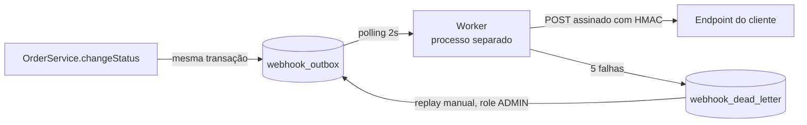

# RFC — Webhooks de Notificação de Mudança de Status de Pedidos

## Metadados

| Campo | Valor |
| --- | --- |
| **Autor** | Larissa (Tech Lead) |
| **Status** | Em revisão |
| **Data** | 2026-10-06 |
| **Revisores** | Marcos (Product Manager), Bruno (Eng. Pleno, Pedidos), Diego (Eng. Sênior, Plataforma), Sofia (Eng. de Segurança) |
| **Origem** | Reunião técnica de kickoff (`TRANSCRICAO.md`) |
| **Documentos relacionados** | [ADRs](./adrs/), [FDD](./FDD.md), [PRD](./PRD.md) |

## Resumo executivo (TL;DR)

Propomos notificar clientes B2B sobre mudanças de status de pedidos por meio de **webhooks de saída**, usando o padrão **Transactional Outbox no MySQL já existente**: o evento é gravado na mesma transação que muda o status do pedido e entregue de forma assíncrona por um **worker em processo separado**, em polling de 2 segundos. A entrega é **at-least-once**, com retry em backoff exponencial (5 tentativas, ~15 horas) e **dead letter queue** com replay manual. Cada requisição é assinada com **HMAC-SHA256** usando uma secret exclusiva por endpoint, rotacionável com 24h de carência.

A proposta não adiciona infraestrutura nova e reaproveita os padrões do projeto. Em troca, aceita latência mínima de até 2s, operação single-worker e deduplicação a cargo do cliente. Ficam em aberto, entre outros pontos, o rate limiting de saída e a notificação ao cliente quando o webhook dele falha.

## Contexto e problema

Três clientes B2B (Atlas Comercial, MaxDistribuição e Nova Cargo) pediram formalmente para serem notificados quando o status dos pedidos deles muda. Hoje eles fazem polling em `GET /orders`, o que torna a integração lenta e cara; a Atlas sinalizou que pode migrar para um concorrente se a entrega não ocorrer até o fim do trimestre (`[09:00] Marcos`). O requisito de latência é "abaixo de 10 segundos" (`[09:02] Marcos`), e o fluxo é apenas de saída, da plataforma para o cliente (`[09:02] Marcos`, `[09:03] Sofia`).

O problema técnico é que a mudança de status acontece em `OrderService.changeStatus` (`src/modules/orders/order.service.ts`), dentro de uma transação que já atualiza `orders`, insere em `order_status_history` e ajusta `stock_quantity`. Precisamos emitir o evento sem que a disponibilidade ou a lentidão de um sistema de terceiros afete essa operação crítica, e sem que exista o caso de "status mudou e evento não saiu" (`[09:40] Bruno`).

## Proposta técnica

A solução tem quatro blocos. O detalhamento (schemas, contratos, fluxos de erro) fica no [FDD](./FDD.md).

**1. Publicação transacional (Outbox).** A mudança de status insere o evento em uma tabela `webhook_outbox` na mesma transação SQL. Se a transação commita, o evento existe; se há rollback, ele some junto ([ADR-001](./adrs/ADR-001-outbox-no-mysql.md)). O payload é gravado já renderizado, como snapshot do pedido naquele instante, para que retries tardios não reflitam um estado posterior ([ADR-008](./adrs/ADR-008-snapshot-do-payload-na-insercao-do-outbox.md)). O evento só é inserido se algum webhook ativo do cliente assina aquele status (`[09:34] Bruno`).

**2. Entrega assíncrona.** Um worker em processo Node separado da API lê os eventos pendentes mais antigos a cada 2 segundos e faz a chamada HTTP ([ADR-002](./adrs/ADR-002-worker-dedicado-em-polling.md)). Opera como single-worker, o que preserva a ordem de entrega por pedido, sem garantia de ordenação global ([ADR-007](./adrs/ADR-007-ordenacao-por-order-id-sem-garantia-global.md)).

**3. Confiabilidade.** A garantia é at-least-once: o cliente pode receber duplicatas e deduplica pelo identificador único do evento, enviado em `X-Event-Id` ([ADR-005](./adrs/ADR-005-garantia-at-least-once-com-event-id.md)). Falhas são retentadas com backoff exponencial em 5 tentativas (1m, 5m, 30m, 2h, 12h); esgotadas, o evento vai para a tabela `webhook_dead_letter`, de onde só volta por replay manual feito por um usuário com role `ADMIN` ([ADR-003](./adrs/ADR-003-retry-com-backoff-e-dead-letter-queue.md)).

**4. Segurança.** O corpo de cada requisição é assinado com HMAC-SHA256. Cada endpoint cadastrado tem secret própria, gerada pela plataforma e rotacionável via API, com a secret anterior válida por mais 24 horas ([ADR-004](./adrs/ADR-004-hmac-sha256-com-secret-por-endpoint.md)). Só são aceitas URLs `https`, e payloads acima de 64KB geram erro em vez de serem truncados (`[09:23] Sofia`, `[09:24] Diego`).

A feature entra como um módulo `src/modules/webhooks` no mesmo molde dos demais, reaproveitando `AppError`, Pino, o middleware de erro e `requireRole` ([ADR-006](./adrs/ADR-006-reuso-dos-padroes-existentes-do-projeto.md)). A superfície de API cobre o cadastro e a gestão de webhooks por cliente, a consulta ao histórico de entregas e o replay administrativo da DLQ (`[09:31]`–`[09:35]`).

## Alternativas consideradas

| # | Alternativa | Por que foi descartada | Origem |
| --- | --- | --- | --- |
| 1 | **Disparo síncrono** dentro da transação de `changeStatus` | Acopla a mudança de status à latência e à disponibilidade do cliente: um endpoint lento trava outros pedidos, e não há rollback aceitável se o cliente estiver fora do ar. Ganharia entrega imediata ao custo da operação crítica. | `[09:04] Bruno`, `[09:06] Diego`; [ADR-001](./adrs/ADR-001-outbox-no-mysql.md) |
| 2 | **Fila dedicada** (Redis Streams ou similar) | Daria recursos nativos de mensageria, mas exige subir e operar infraestrutura nova, considerada overengineering para um time pequeno. O MySQL existente resolve. | `[09:07] Larissa`, `[09:07] Diego`; [ADR-001](./adrs/ADR-001-outbox-no-mysql.md) |
| 3 | **Trigger de banco** para acionar o worker de forma reativa | Reduziria a latência abaixo de 2s, mas o MySQL não notifica processos externos (não há equivalente ao `LISTEN/NOTIFY`); exigiria improvisos frágeis. O polling já atende ao requisito de 10s. | `[09:09] Bruno`, `[09:09] Diego`; [ADR-002](./adrs/ADR-002-worker-dedicado-em-polling.md) |
| 4 | **Retry indefinido** ou **teto de 3 tentativas** | Indefinido deixa eventos pendurados para sempre se o cliente sumiu. Três tentativas matam o evento em ~30 minutos, antes de uma manutenção planejada de 2 horas terminar, caso já observado. | `[09:15]`–`[09:16] Diego`, `[09:16] Bruno`; [ADR-003](./adrs/ADR-003-retry-com-backoff-e-dead-letter-queue.md) |
| 5 | **Garantia exactly-once** | Eliminaria duplicatas, mas exige coordenação dos dois lados e é muito mais complexa. At-least-once com `X-Event-Id` é o padrão de mercado (Stripe, GitHub). | `[09:25] Diego`, `[09:25] Sofia`; [ADR-005](./adrs/ADR-005-garantia-at-least-once-com-event-id.md) |
| 6 | **Secret global** da plataforma | Mais simples de gerenciar, mas o vazamento de uma secret comprometeria todos os clientes. | `[09:21] Sofia`; [ADR-004](./adrs/ADR-004-hmac-sha256-com-secret-por-endpoint.md) |

## Questões em aberto

Pontos levantados na reunião e não decididos ou adiados. Pedimos posição dos revisores.

1. **Rate limiting de saída.** Se um cliente tiver 50 pedidos mudando de status em um minuto, receberá 50 chamadas. Ficou fora do escopo, como "observar e decidir depois" (`[09:38] Diego`, `[09:39] Larissa`). Em aberto: qual sinal dispara a decisão e quem acompanha.
2. **Aviso ao cliente quando o webhook dele falha.** A notificação por email após falhas consecutivas foi adiada para uma próxima fase, "depois que a gente medir o impacto" (`[09:37] Marcos`, `[09:37] Larissa`). Até lá, o cliente só percebe o problema consultando o histórico de entregas.
3. **Escala além de single-worker.** Múltiplos workers quebram a ordenação por pedido; particionamento por `order_id` ou lock pessimista foram citados, sem escolha (`[09:13] Diego`). Ver [ADR-007](./adrs/ADR-007-ordenacao-por-order-id-sem-garantia-global.md).
4. **Retenção da outbox.** Foi mencionado arquivar linhas entregues "depois de 30 dias ou assim", fora do escopo desta feature (`[09:08] Diego`). Não há prazo nem responsável definidos.
5. **Autorização do CRUD de webhooks.** Qualquer role autenticada pode gerenciar webhooks "por enquanto"; o endurecimento ficou para depois, sem critério definido (`[09:36] Marcos`, `[09:37] Sofia`).
6. **Como o `customer_id` é informado.** Ficou estabelecido que não vem do JWT, mas não se é passado no body ou no path (`[09:32] Larissa`). Deve ser fechado no FDD.

## Impacto e riscos

**Impacto**

- **Módulo de pedidos:** `OrderService.changeStatus` passa a gravar na outbox dentro da transação existente. É a única alteração em código crítico já em produção (`[09:40] Bruno`).
- **Banco de dados:** novas tabelas (configuração de webhooks, outbox, dead letter e histórico de entregas) na mesma instância MySQL que sustenta os pedidos.
- **Operação:** um segundo processo passa a ser implantado e monitorado, além da API.
- **Clientes:** precisam validar a assinatura HMAC e deduplicar por `X-Event-Id`; Marcos documenta no portal do desenvolvedor (`[09:26] Marcos`).
- **Prazo:** três sprints, com pelo menos dois dias úteis de revisão de segurança antes do deploy; a Atlas espera a entrega até o fim de novembro (`[09:45]`–`[09:47]`).

**Riscos**

Probabilidade e impacto são estimativas do autor, abertas à revisão.

| Risco | Probabilidade | Impacto | Mitigação |
| --- | --- | --- | --- |
| Falha na inserção da outbox passa a causar rollback da mudança de status | Baixa | Alto | Comportamento intencional (`[09:40] Bruno`); cobrir com testes ponta a ponta a integração em `changeStatus`. |
| Cliente não deduplica por `X-Event-Id` e processa o mesmo evento duas vezes | Média | Médio | Destaque na documentação do portal ([ADR-005](./adrs/ADR-005-garantia-at-least-once-com-event-id.md)). |
| Worker único parado ou sobrecarregado atrasa todas as entregas | Média | Alto | Eventos permanecem na outbox e são entregues na retomada; a evolução para múltiplos workers é a questão em aberto 3. |
| Crescimento da outbox degrada a leitura do worker | Média | Médio | Índices em status e `created_at`, leitura em lotes pequenos ([ADR-001](./adrs/ADR-001-outbox-no-mysql.md)); política de retenção é a questão em aberto 4. |
| Vazamento de secret do lado do cliente (caso já ocorrido, `[09:22] Diego`) | Média | Médio | Secret por endpoint limita o alcance; rotação via API com 24h de carência ([ADR-004](./adrs/ADR-004-hmac-sha256-com-secret-por-endpoint.md)). |
| Rajada de eventos sobrecarrega o endpoint de um cliente | Baixa | Médio | Sem mitigação nesta fase; observar (questão em aberto 1). |
| Eventos na DLQ ficam sem reprocessamento por depender de ação manual | Média | Médio | Replay administrativo com registro de quem executou, para auditoria (`[09:36] Sofia`); o aviso ao cliente é a questão em aberto 2. |
| Prazo de três sprints estoura e compromete o compromisso com a Atlas | Média | Alto | Reuso dos padrões existentes ([ADR-006](./adrs/ADR-006-reuso-dos-padroes-existentes-do-projeto.md)); email, dashboard e rate limiting fora do escopo; revisão de segurança agendada com antecedência. |

## Decisões relacionadas

| ADR | Decisão |
| --- | --- |
| [ADR-001](./adrs/ADR-001-outbox-no-mysql.md) | Padrão Outbox no MySQL para publicação de eventos |
| [ADR-002](./adrs/ADR-002-worker-dedicado-em-polling.md) | Worker em processo separado, com polling de 2 segundos |
| [ADR-003](./adrs/ADR-003-retry-com-backoff-e-dead-letter-queue.md) | Retry com backoff exponencial e DLQ em tabela separada |
| [ADR-004](./adrs/ADR-004-hmac-sha256-com-secret-por-endpoint.md) | HMAC-SHA256 com secret por endpoint e rotação com carência |
| [ADR-005](./adrs/ADR-005-garantia-at-least-once-com-event-id.md) | Entrega at-least-once com deduplicação via `X-Event-Id` |
| [ADR-006](./adrs/ADR-006-reuso-dos-padroes-existentes-do-projeto.md) | Reuso dos padrões arquiteturais existentes no projeto |
| [ADR-007](./adrs/ADR-007-ordenacao-por-order-id-sem-garantia-global.md) | Ordenação apenas por `order_id`, dependente de single-worker |
| [ADR-008](./adrs/ADR-008-snapshot-do-payload-na-insercao-do-outbox.md) | Payload renderizado como snapshot na inserção da outbox |
